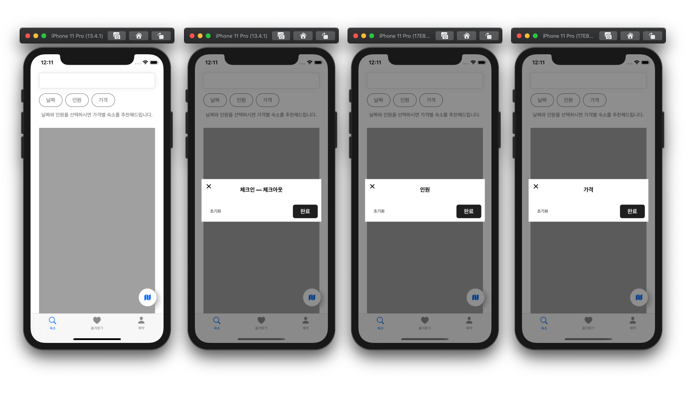

# Airbnb iOS

숙소예약 서비스 iOS 앱

> 팀원: Jason, Heidi

## Task 목록

[스프레드시트 링크][spreadsheet]

## 단계별 구현 내용

### 메인 검색 화면 구현

> [PR # [iOS] ][pr.....]

* [Pair] 기본 탭바 컨트롤러와 뷰 컨트롤러 구현 [Issue][issue3] [PR][pr4]
* [Jason] Tab Bar에 연결된 뷰 컨트롤러 생성 부분 리팩토링 [Issue][issue11] [PR][pr12]
* [Heidi] 코드로 구현한 탭바 컨트롤러를 스토리보드로 변경 [Issue][issue15] [PR][pr16]
* [Jason] 커스텀 뱃지 레이블 구현 [Issue][issue6] [PR][pr20]
* [Jason] 커스텀 서치 텍스트필드 구현 [Issue][issue7] [PR][pr22]
* [Jason] 커스텀 Guide 레이블 구현 [Issue][issue8] [PR][pr23]
* [Heidi] 상단 커스텀 버튼 클래스 구현 및 버튼 상속 관계 설계 [Issue][issue14] [PR][pr25]
* [Jason] 불필요한 뷰모델 제거 [Issue][issue27] [PR][pr28]
* [Heidi] 현재까지 구현된 커스텀 뷰들을 스토리보드에 올리고 레이아웃 지정 [Issue][issue30] [PR][pr35]
* [Jason] 이미지 페이징 뷰 구현 [Issue][issue5] [PR][pr37]
* [Jason] 뷰 그림자 설정 메서드 프로토콜화 [Issue][issue34] [PR][pr38]
* [Jason] 맵 버튼 구현 [Issue][issue40] [PR][pr46]
* [Heidi] Filter VC 및 화면 전환 구현 [Issue][issue49] [PR][pr56]

**실행 결과**

[spreadsheet]: https://docs.google.com/spreadsheets/d/1mEWSSgX4h4rGINgtG6D2y6Qk0B0QxjHbdrxlQimck3Y/edit?usp=sharing

[issue3]: https://github.com/codesquad-member-2020/airbnb-02/issues/3
[issue5]: https://github.com/codesquad-member-2020/airbnb-02/issues/5
[issue6]: https://github.com/codesquad-member-2020/airbnb-02/issues/6
[issue7]: https://github.com/codesquad-member-2020/airbnb-02/issues/7
[issue8]: https://github.com/codesquad-member-2020/airbnb-02/issues/8
[issue11]: https://github.com/codesquad-member-2020/airbnb-02/issues/11
[issue14]: https://github.com/codesquad-member-2020/airbnb-02/issues/14
[issue15]: https://github.com/codesquad-member-2020/airbnb-02/issues/15
[issue27]: https://github.com/codesquad-member-2020/airbnb-02/issues/27
[issue30]: https://github.com/codesquad-member-2020/airbnb-02/issues/30
[issue34]: https://github.com/codesquad-member-2020/airbnb-02/issues/34
[issue40]: https://github.com/codesquad-member-2020/airbnb-02/issues/40
[issue49]: https://github.com/codesquad-member-2020/airbnb-02/issues/49

[pr4]: https://github.com/codesquad-member-2020/airbnb-02/pull/4
[pr12]: https://github.com/codesquad-member-2020/airbnb-02/pull/12
[pr16]: https://github.com/codesquad-member-2020/airbnb-02/pull/16
[pr20]: https://github.com/codesquad-member-2020/airbnb-02/pull/20
[pr22]: https://github.com/codesquad-member-2020/airbnb-02/pull/22
[pr23]: https://github.com/codesquad-member-2020/airbnb-02/pull/23
[pr25]: https://github.com/codesquad-member-2020/airbnb-02/pull/25
[pr28]: https://github.com/codesquad-member-2020/airbnb-02/pull/28
[pr35]: https://github.com/codesquad-member-2020/airbnb-02/pull/35
[pr37]: https://github.com/codesquad-member-2020/airbnb-02/pull/37
[pr38]: https://github.com/codesquad-member-2020/airbnb-02/pull/38
[pr46]: https://github.com/codesquad-member-2020/airbnb-02/pull/46
[pr56]: https://github.com/codesquad-member-2020/airbnb-02/pull/56

